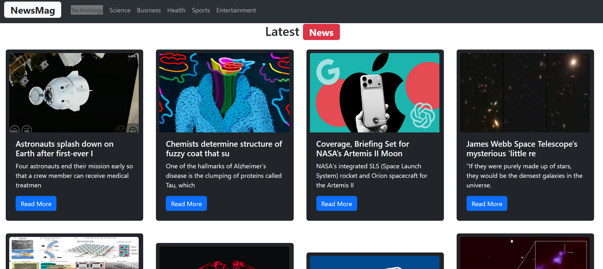

# 📰 NewsMag – React News Application

**NewsMag** is a modern news application built with **React** and **Vite**, allowing users to stay updated with the latest news from around the world.  
Users can browse news by categories such as **Technology, Science, Business, Health, Sports, and Entertainment**.

---

## ✨ Features
- **Real-time news** – Fetches the latest news using **NewsAPI**
- **Multiple categories** – Technology, Science, Business, Health, Sports, Entertainment
- **Responsive design** – Built with **Bootstrap 5**, works on all screen sizes
- **Component-based architecture** – Easy to maintain and scale
- **Fast development** – Powered by **Vite** with Hot Module Replacement (HMR)

---

## 🛠 Technologies Used
- **JavaScript (ES6+)** – Core programming language  
- **React** – Frontend library for building UI components  
- **Vite** – Modern build tool and development server  
- **HTML5 & CSS3 / Bootstrap 5** – Structure and responsive styling  
- **NewsAPI** – Real-time news data  
- **Git & GitHub** – Version control and code hosting  

---

## 📸 Demo Screenshots

  
  
  
  

---

## ⚠️ Note
Due to **NewsAPI free plan restrictions**, live API requests work on **localhost** only.  
The GitHub Pages demo uses sample data to prevent runtime errors.

---

npm install
npm run dev
